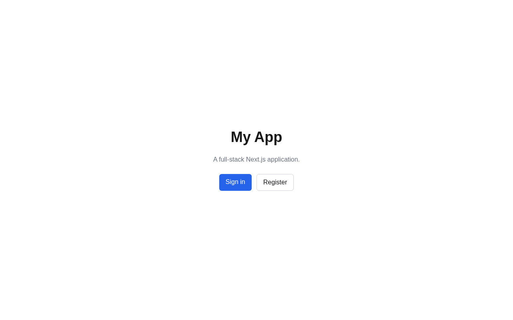
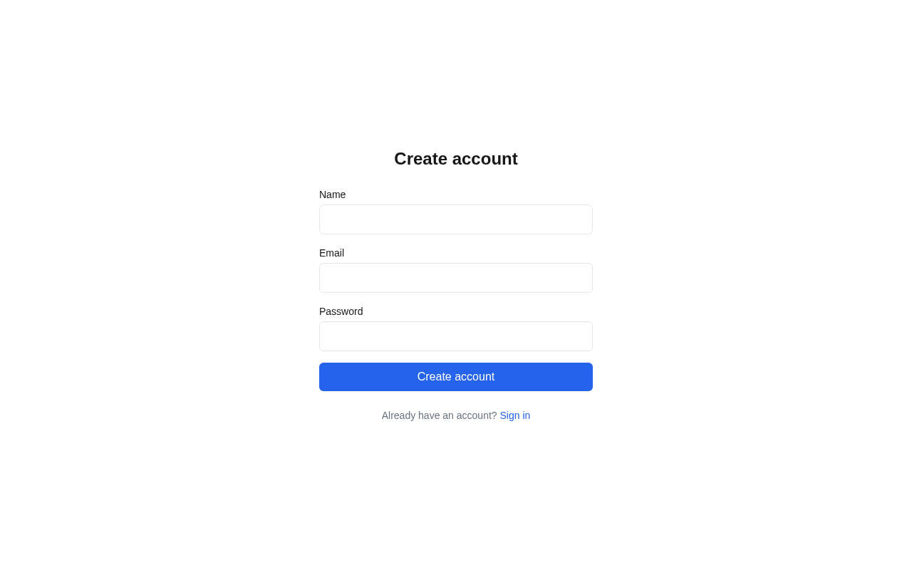
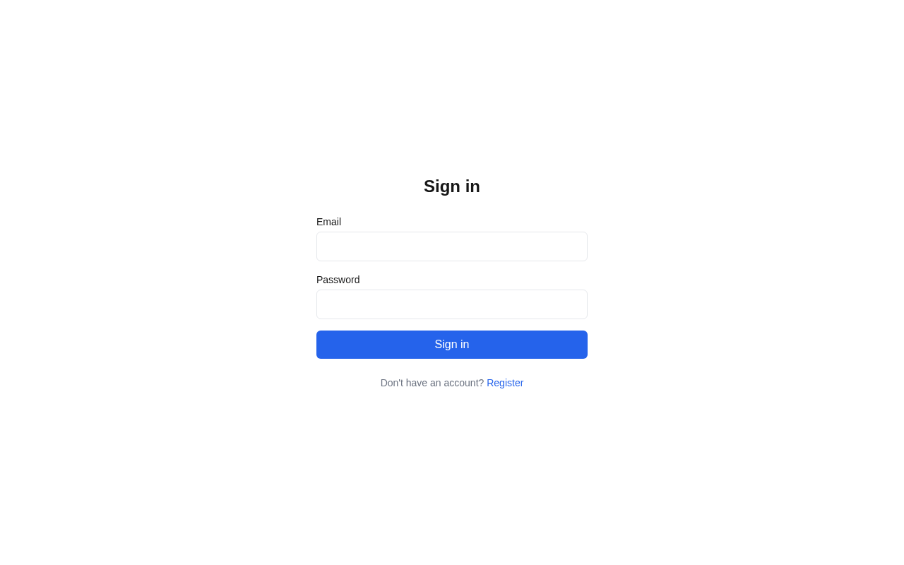
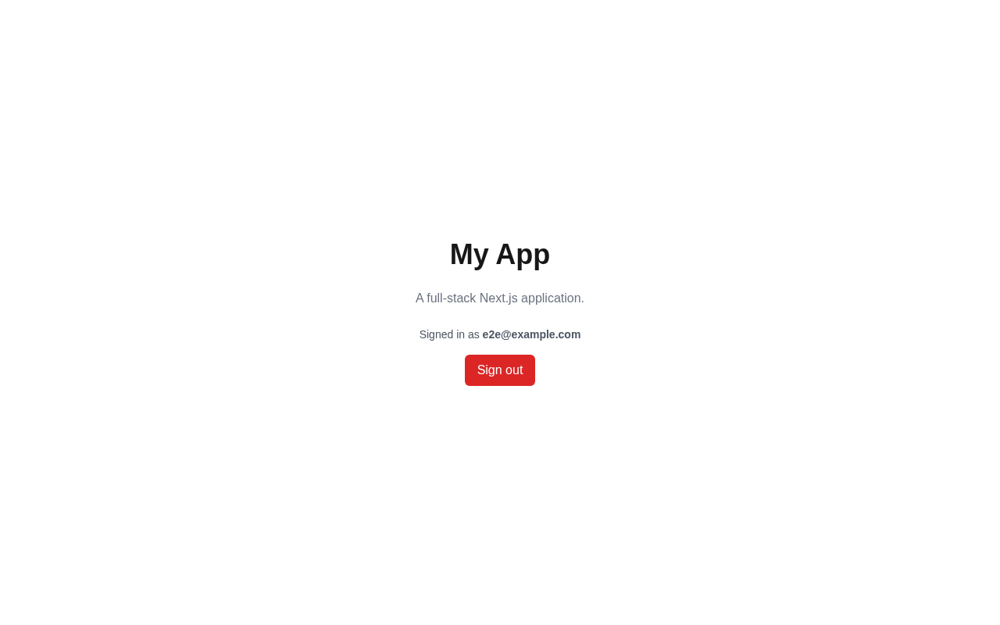

# My App

A full-stack Next.js 14 web application with authentication and SQLite.

> **Note:** This is a test project built to evaluate [Gas Town](https://github.com/steveyegge/gastown), an agentic AI development system.

<!-- ci validation -->

**Stack:** Next.js 14 (App Router) · TypeScript · Tailwind CSS · NextAuth.js v5 · Drizzle ORM · SQLite (better-sqlite3)

---

## Screenshots

| | |
|---|---|
|  |  |
|  |  |

---

## Prerequisites

- [DevPod](https://devpod.sh/) + Docker (recommended)
- Or Node.js 22 LTS + npm

---

## Getting Started

### 1. Using DevPod (recommended)

```bash
# Add the Docker provider (first time only)
devpod-cli provider add docker

# Start the container
make devpod-up

# SSH into the container
make devpod-ssh
```

Once inside the container, run first-time setup:

```bash
make setup
```

This creates `.env` with a generated `AUTH_SECRET`, installs npm packages, and installs the Playwright Chromium browser.

### 2. Without DevPod

```bash
make setup
```

---

## Makefile

Run `make` (no arguments) to list all available targets:

```
  setup                  Full first-time setup (env + deps + browsers)
  env                    Copy .env.example → .env and generate AUTH_SECRET
  playwright-install     Install Playwright browsers and system dependencies
  install                Install npm dependencies
  dev                    Start the development server (http://localhost:3000)
  build                  Build for production
  start                  Start the production server (requires build first)
  lint                   Run ESLint
  test                   Run Vitest API integration tests
  test-watch             Run Vitest in watch mode
  test-e2e               Run Playwright E2E tests (headless)
  test-e2e-ui            Open Playwright interactive UI
  test-e2e-headed        Run Playwright E2E tests with visible browser
  test-all               Run all tests (Vitest + Playwright)
  db-generate            Generate Drizzle migration files from schema changes
  db-migrate             Apply pending Drizzle migrations
  db-studio              Open Drizzle Studio (visual database browser)
  devpod-up              Start (or resume) the DevPod container
  devpod-rebuild         Rebuild the DevPod container from scratch
  devpod-ssh             SSH into the running DevPod container
  kind-create            Create local kind cluster
  kind-delete            Delete local kind cluster
  kind-status            Show cluster info
  kind-reset             Delete and recreate cluster
  kind-build             Build the app Docker image
  kind-load              Load the app image into the kind cluster
  kind-apply             Apply Kubernetes manifests
  kind-rollout           Wait for the app deployment to become ready
  kind-deploy            Full deploy: build → load → apply → wait
  kind-logs              Tail app logs from the running pod
  kind-teardown          Remove all deployed Kubernetes resources
  kind-seed              Seed E2E test user into the running kind deployment
  kind-test              Run Vitest API integration tests
  kind-test-e2e          Run Playwright E2E tests against the kind deployment
  kind-test-all          Run full test suite against the kind deployment
  clean                  Remove build artifacts and caches
```

### Common workflows

**Start developing (first time):**
```bash
make devpod-up    # start container (host)
make devpod-ssh   # enter container (host)
make setup        # install deps, generate .env, install Playwright
make dev          # start dev server (inside container)
```

**Resume after restart:**
```bash
make devpod-up    # resume container
make devpod-ssh   # enter container
make dev          # deps already installed
```

**Run tests:**
```bash
make test         # Vitest API tests
make test-e2e     # Playwright E2E tests
make test-all     # both
```

**After changing the DB schema:**
```bash
make db-generate  # generate migration
make db-migrate   # apply it
```

**Before shipping:**
```bash
make lint
make test-all
make build
```

**Rebuild the container** (e.g. after changing `devcontainer.json`):
```bash
make devpod-rebuild
```

---

## Kubernetes development (kind)

The devcontainer includes Docker-in-Docker, kind, kubectl, and helm. This lets you spin up a full local Kubernetes cluster and deploy the app to it — entirely inside the devcontainer, no host-level setup required.

### First-time cluster setup

```bash
make kind-create    # creates the "gttest" cluster (single control-plane node)
```

### Deploy the app to kind

```bash
make kind-deploy    # docker build → kind load → kubectl apply → rollout wait
```

The app is now reachable at **http://localhost:30000** (NodePort mapped through kind's port forwarding).

### Run all tests against the kind deployment

```bash
make kind-test-all  # Vitest API tests + Playwright E2E against localhost:30000
```

Or individually:

```bash
make kind-test      # Vitest (in-process, uses local SQLite)
make kind-test-e2e  # Playwright E2E — seeds the DB in the pod first, then runs
```

### Full kind workflow from scratch

```bash
# All inside the devcontainer (ssh rig.devpod or make devpod-ssh)
make setup          # install deps + Playwright browsers
make kind-create    # create the cluster
make kind-deploy    # build image, load into kind, deploy
make kind-test-all  # run 16 Vitest + 8 Playwright E2E tests against the cluster
```

### Useful day-to-day commands

```bash
make kind-logs      # tail the app pod logs
make kind-seed      # re-seed the E2E test user (clears existing data)
make kind-status    # kubectl cluster-info
make kind-reset     # delete + recreate the cluster
make kind-teardown  # remove all deployed k8s resources (keeps the cluster)
```

### How it works

- **Docker-in-Docker**: kind nodes are Docker containers managed by the daemon running *inside* the devcontainer. `127.0.0.1` resolves correctly within the container, so kubectl and NodePort access work without any additional routing.
- **`AUTH_TRUST_HOST=1`**: NextAuth v5 requires this env var when the app runs behind a proxy/NodePort where the request host can differ from `NEXTAUTH_URL`.
- **`scripts/migrate.mjs`**: bootstraps the SQLite schema at container startup; used as the Docker `CMD` so no drizzle-kit is needed at runtime.
- **`scripts/kind-seed.mjs`**: seeds the known E2E test user into the running pod via `kubectl exec` before Playwright runs.

---

## Database

SQLite (`local.db`) via Drizzle ORM. Created automatically on first run. Schema is in `lib/db/schema.ts`.

---

## Project Structure

```
app/
  (auth)/
    login/               # Login page
    register/            # Register page
  api/
    auth/[...nextauth]/  # NextAuth handler
    register/            # POST /api/register
  layout.tsx
  page.tsx               # Home (auth-aware)
  globals.css
lib/
  auth.ts                # NextAuth config (JWT + credentials)
  db/
    index.ts             # Drizzle + SQLite connection
    schema.ts            # users, sessions, accounts, verificationTokens
components/
  ui/                    # Shared UI components
tests/
  api/                   # Vitest API route tests
  e2e/                   # Playwright browser tests
  helpers/               # Shared test utilities
  setup.ts               # Vitest global setup
drizzle/                 # Generated migration files
scripts/
  migrate.mjs            # DB bootstrap (used by Docker CMD)
  kind-seed.mjs          # Seeds E2E user into the kind pod
k8s/
  00-namespace.yaml      # gttest namespace
  deployment.yaml        # App deployment (emptyDir SQLite, NodePort 30000)
  service.yaml           # NodePort service
.devcontainer/
  devcontainer.json      # DinD + kubectl + helm + kind features
Dockerfile               # Production image
kind-config.yaml         # kind cluster definition
playwright.config.ts     # Playwright config (local dev server)
playwright.kind.config.ts  # Playwright config (kind deployment)
```
